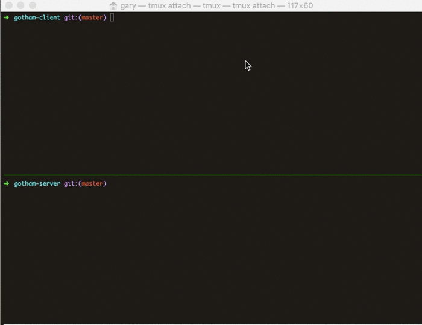
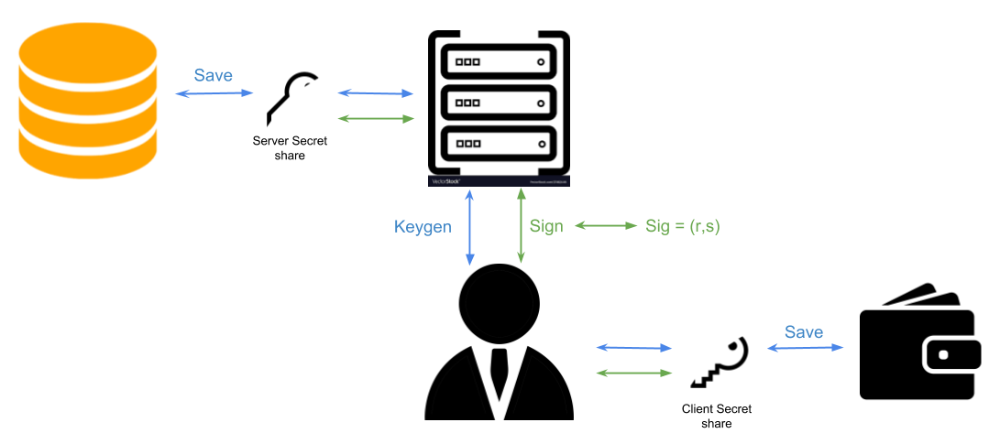

# NOTES: The mobile client is re-created & developing at [here](https://github.com/ezsyfi/TSS-wallet-mobile). This repo is now only used to develop TSS server.

Newyork City
=====================================
Newyork city is a fully functional client/server application of a minimalist decentralized HD wallet using 2 party ECDSA.

Supported Blockchain(s) / Coin(s)
-------
### Server
Newyork **server** is coin / blockchain agnostic but Elliptic Curve specific.

List of supported Curve(s):

 * secp256k1

### Client
Newyork **client** is coin / blockchain specific.

List of supported Coin(s):

 * BTC

**Extending the client to support more coin(s) is easy as long as the Elliptic Curve and signing scheme of the new blockchain are supported. In the case a blockchain is using secp256k1 together with ECDSA, the same keygen and signing code can be reused.**

|  |
|-----------------------------|

Disclaimer
-------
### **USE AT YOUR OWN RISK, we are not responsible for software/hardware and/or any transactional issues that may occur while using Newyork city.**

Project Status
-------
The project is currently work in progress. For more information you can [email us](mailto:github@kzencorp.com).

Elements
-------

|                                                 | Newyork Server                                | Newyork Client                                |
| -------------------------------------------- | -------------------------------------------- |--------------------------------------------
| Description | RESTful web service exposing APIs for two party ECDSA key generation and signing | Bitcoin minimalist decentralized wallet CLI app |
| Instructions | [View](newyork-server/README.md) | [View](newyork-client/README.md) |

Project Description
-------

### Design Overview

#### ECDSA Keygen and Signing

* For details on Threshold Signatures see [Threshold Signatures: The Future of Private Keys](https://medium.com/kzen-networks/threshold-signatures-private-key-the-next-generation-f27b30793b)

#### Cryptographic libraries
* [secp256k1](https://github.com/rust-bitcoin/rust-secp256k1/): Rust language bindings for Bitcoin secp256k1 library.
* [curv](https://github.com/KZen-networks/curv) : basic ECC primitives using secp256k1
* [rust-paillier](https://github.com/mortendahl/rust-paillier): A pure-Rust implementation of the Paillier encryption scheme
* [zk-paillier](https://github.com/KZen-networks/zk-paillier): A collection of zero knowledge proofs using Paillier cryptosystem 
* [multi-party-ecdsa](https://github.com/KZen-networks/multi-party-ecdsa): Rust implelemtation of Lindell's Crypto17 paper: [Fast Secure Two-Party ECDSA Signing](https://eprint.iacr.org/2017/552)
* [kms](https://github.com/KZen-networks/kms): Two party key managament system (master keys, 2p-HD, shares rotation) for secp256k1 based two party digital sigantures 

### White paper overview
#### Abstract
We demonstrate a Bitcoin wallet that utilizes two party ECDSA (2P-ECDSA).
Our architecture relies on a simple client-server communication
model. We show support for 2 party deterministic child derivation
(2P-HD), secret share rotation and verifiable recovery. We discuss the
opportunities and challenges of using a multi-party wallet.

#### Background
For end-users, cryptocurrencies and blockchain-based assets are hard to store and manage.
One of the reasons is the tradeoff between security and availability.
Storing private keys safely requires dedicated hardware or extreme security measures which make using the coins
on a daily basis difficult. Threshold cryptography provides ways to distribute the private key and digital signing.
This can potentially benefit security but at the same time reveal new challenges such as availability, ownership and recovery.
Bitcoin is utilizing ECDSA as the signing scheme. There is an active line of research for practical and efficient multi-party ECDSA schemes.

**For more information, see our [white paper](white-paper/white-paper.pdf)**.

### Comperative Performance
The comparison was done on an Intel i9-8950HK (2.9GHz) using localhost for server (no real network). The numbers are mean for 20 runs of 2P-ECDSA KeyGen and 50 runs for 2P-ECDSA Signing. Standard deviation is inconsistent but for both implementations it is order of magnitude smaller than mean value.

|        Implementation         |   Newyork city (this repo)    |    [Unbound](https://github.com/unbound-tech/blockchain-crypto-mpc)       | 
|-------------------------------|------------------------|------------------------|
| 2P-ECDSA KeyGen                      |        1.05 s            |      **0.813** s           |
|    2P-ECDSA Signing    |      **0.153** s        |      0.206 s     |

License
-------
Newyork City is released under the terms of the GPL-3.0 license. See [LICENSE](LICENSE) for more information.

Contact
-------
For any questions, feel free to [email us](mailto:github@kzencorp.com) or join ZenGo X [Telegram](https://t.me/joinchat/ET1mddGXRoyCxZ-7).
