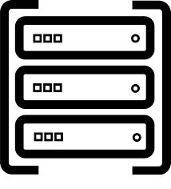

# Newyork Server


## Introduction
Newyork server is a RESTful web service exposing APIs for two party ECDSA key generation and signing.

## Installation
### Launching the server
```bash
git clone https://github.com/KZen-networks/newyork-city.git
cd newyork-city/newyork-server
make run
```

* By default, the server will use a local [RocksDB](https://rocksdb.org/).<br> 

### RocksDB Debugging Tool
https://github.com/facebook/rocksdb/wiki/Administration-and-Data-Access-Tool#ldb-tool

### Running tests
#### Without timing output
```bash
RUST_TEST_THREADS=1 cargo test --release
```

#### With timing output
```bash
RUST_TEST_THREADS=1  cargo test --release -- --nocapture
```
